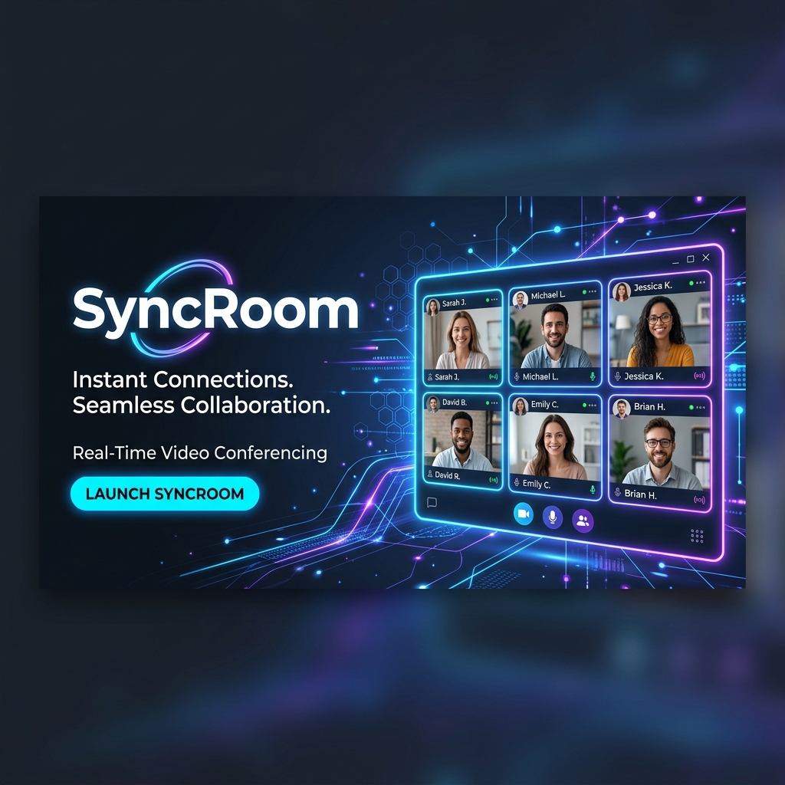
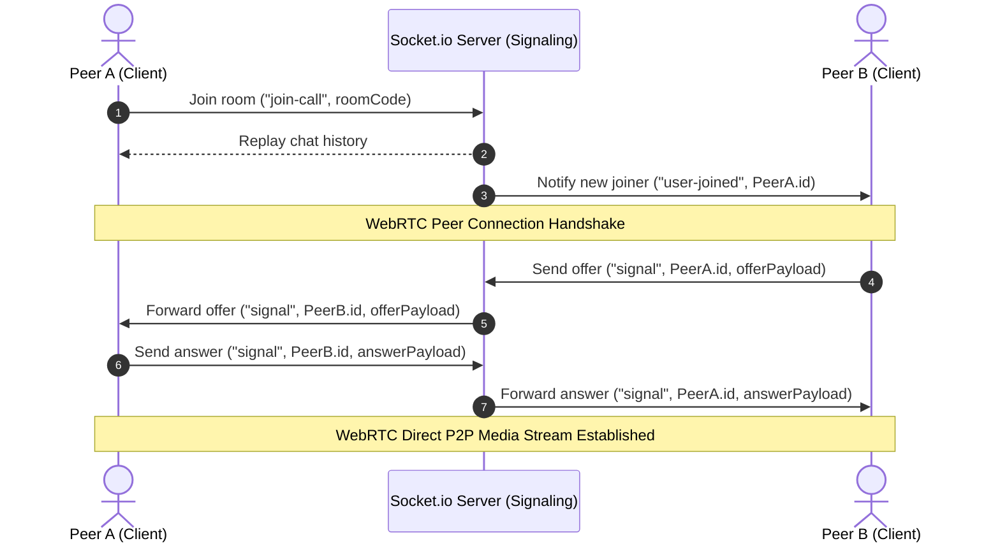

# SyncRoom 🎥💻

<p align="center">
  
</p>

<p align="center">
  
  
  
  
  
  
  
</p>

---

## 🌟 Introduction

**SyncRoom** is a highly secure, real-time video conferencing application designed for low-latency collaboration. By leveraging **WebRTC Mesh architecture** and **Socket.io** for real-time signaling, users can establish direct peer-to-peer video, audio, and chat rooms instantly. The application is built with a solid security foundation featuring token-based user authentication and meeting activity logs.

---

## 🚀 Key Features

* **🔒 Secure Authentication:** Registration and login system using secure bcrypt password hashing and JSON Web Tokens (JWT).
* **📹 High-Quality Video & Audio:** Smooth, peer-to-peer streams using native browser WebRTC connections.
* **💬 Real-time Group Chat:** In-room chat messages dynamically synced using Socket.io without interrupting the video/audio feed.
* **🕒 Meeting History Logs:** Log, track, and retrieve previous meeting activities for authenticated profiles.
* **🔗 Auto-Generated Meeting Rooms:** Instantly spin up unique, shareable meeting rooms with isolated contexts.

---

## 🏗️ System Architecture

SyncRoom uses a hybrid architecture combining a REST API server, a WebSockets (Socket.io) server for signaling, and a direct WebRTC peer-to-peer connection for streaming.



---

## 📂 Project Structure

```text
SyncRoom/
├── backend/
│   ├── src/
│   │   ├── config/       # MongoDB database connection setup
│   │   ├── controllers/  # Route logic & Socket.io room manager
│   │   ├── middlewares/  # JWT validation & centralized error handler
│   │   ├── models/       # Mongoose Schemas (User & Meeting models)
│   │   ├── routes/       # Express API routes
│   │   ├── app.js        # Express application configuration
│   │   └── server.js     # Server entry point (HTTP & Socket.io listen)
│   └── .env              # Backend environment variables
│
└── frontend/
    ├── src/
    │   ├── context/      # AuthState management using React Context
    │   ├── pages/        # Page views (Home, VideoMeet, Auth, History, Landing)
    │   ├── styles/       # Standard and page-specific CSS styles
    │   ├── utils/        # Authentication Higher-Order Component (withAuth)
    │   ├── App.js        # Route configuration using React Router
    │   └── index.js      # React entry point
    └── package.json
```

---

## ⚙️ API Reference

### User Authentication

#### 1. Register User
* **Endpoint:** `POST /api/v1/users/register`
* **Content-Type:** `application/json`
* **Request Body:**
  ```json
  {
    "name": "Jane Doe",
    "username": "janedoe",
    "password": "securepassword123"
  }
  ```
* **Success Response (201 Created):**
  ```json
  {
    "_id": "603d2b781a94e82e30f1d530",
    "name": "Jane Doe",
    "username": "janedoe",
    "token": "eyJhbGciOiJIUzI1NiIsIn..."
  }
  ```

#### 2. Login User
* **Endpoint:** `POST /api/v1/users/login`
* **Content-Type:** `application/json`
* **Request Body:**
  ```json
  {
    "username": "janedoe",
    "password": "securepassword123"
  }
  ```
* **Success Response (200 OK):**
  ```json
  {
    "_id": "603d2b781a94e82e30f1d530",
    "name": "Jane Doe",
    "username": "janedoe",
    "token": "eyJhbGciOiJIUzI1NiIsIn..."
  }
  ```

---

### Activity & History (Protected Routes)
*Requires header: `Authorization: Bearer <JWT_TOKEN>`*

#### 3. Log Meeting Activity
* **Endpoint:** `POST /api/v1/users/add_to_activity`
* **Content-Type:** `application/json`
* **Request Body:**
  ```json
  {
    "meeting_code": "abc-xyz-123"
  }
  ```
* **Success Response (201 Created):**
  ```json
  {
    "message": "Added code to history"
  }
  ```

#### 4. Fetch User Meeting History
* **Endpoint:** `GET /api/v1/users/get_all_activity`
* **Success Response (200 OK):**
  ```json
  [
    {
      "_id": "60bdc576fd3e6a0015f8a09b",
      "user_id": "janedoe",
      "meetingCode": "abc-xyz-123",
      "date": "2026-06-05T07:30:00.000Z"
    }
  ]
  ```

---

## ⚡ Socket.io Events Reference

The Signaling service uses WebSockets (Socket.io) to synchronize room connections. Below is the specification of core real-time events.

### Client-to-Server (Emit)
| Event | Payload | Description |
| :--- | :--- | :--- |
| `join-call` | `roomCode` | Connects a client to a specific video room namespace and triggers signaling. |
| `signal` | `toId, message` | Passes connection configuration/WebRTC SDP signals between clients. |
| `chat-message` | `data, sender` | Broadcasts in-room instant text message to all users in the active room. |

### Server-to-Client (Listen)
| Event | Payload | Description |
| :--- | :--- | :--- |
| `user-joined` | `socketId, connectionsList` | Notifies the room that a new participant has successfully joined. |
| `signal` | `fromId, message` | Receives incoming SDP negotiation or ICE Candidate from a remote peer. |
| `chat-message` | `data, sender, socketId` | Receives in-room text messages from other participants. |
| `user-left` | `socketId` | Informs all clients when a peer has disconnected from the room. |

---

## 🗄️ Database Schemas

### User Schema
```javascript
{
  name: { type: String, required: true },
  username: { type: String, required: true, unique: true },
  password: { type: String, required: true }
}, { timestamps: true }
```

### Meeting Schema
```javascript
{
  user_id: { type: String, index: true },
  meetingCode: { type: String, required: true, index: true },
  date: { type: Date, default: Date.now, required: true }
}
```

---

## 🛠️ Installation & Setup

### Prerequisites
* [Node.js](https://nodejs.org/) (v16 or higher recommended)
* [MongoDB](https://www.mongodb.com/) (Local server or MongoDB Atlas Cloud URI)

### Step 1: Clone the Repository
```bash
git clone <repository-url>
cd SyncRoom
```

### Step 2: Configure Environment Variables
Create a file named `.env` in the `backend` folder:
```env
PORT=8000
MONGO_URI=mongodb+srv://<username>:<password>@cluster.mongodb.net/syncroom?retryWrites=true&w=majority
JWT_SECRET=your_super_secret_jwt_key
OVERRIDE_DNS=false # Set to true to override DNS configuration for local debugging
```

### Step 3: Install Backend Dependencies
```bash
cd backend
npm install
```

### Step 4: Install Frontend Dependencies
```bash
cd ../frontend
npm install
```

---

## 🏃 Running the Application

### Start Backend Server
```bash
cd backend
npm run dev
```
*The backend server will run on `http://localhost:8000` by default.*

### Start Frontend Client
```bash
cd frontend
npm start
```
*The frontend development server will launch on `http://localhost:3000`.*

---

## 🔮 Future Roadmap
* 🖥️ **Screen Sharing:** Collaborative presentation interface.
* 🎙️ **Host Controls:** Ability for meeting hosts to mute/unmute or kick participants.
* 🌐 **STUN/TURN Servers:** Turnkey configuration of custom STUN/TURN servers to bypass corporate firewalls and improve media connection success rate.
